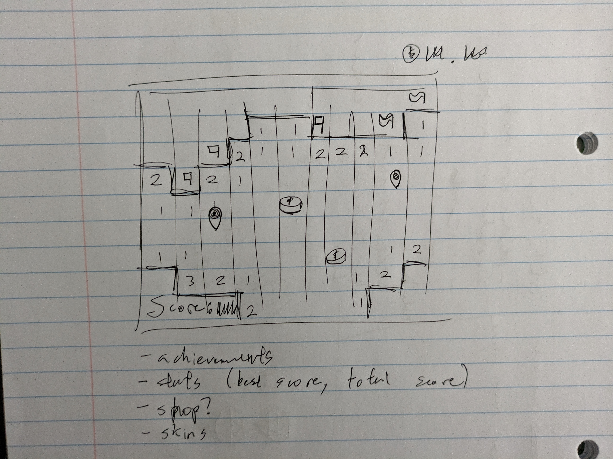

# infinisweeper

An online, globally multiplayer minesweeper. Play with your friends and compete from the longest run!

- HTML - login/profile/settings pages
- CSS - making a cohesive and clean style for the site
- JS - all the logic for the minesweeper
- Authentication - letting users log in so they can store their all time progress
- Database - saving that all time progress
- Websockets - letting users communicate to the server and play together

## CSS Deliverable

 - [x] Prerequisite: Simon CSS deployed to your production environment
 - [x] Prerequisite: A link to your GitHub startup repository prominently displayed on your application's home page
 - [x] Prerequisite: Notes in your startup Git repository README.md file
 - [x] 30% Header, footer, and main content body
 - [x] 20% Navigation elements (navbar)
 - [x] 10% Responsive to window resizing
 - [x] 20% Application elements (style is consistent, there are buttons)
 - [x] 10% Application text content (text is consistent with logo and itself)
 - [x] 10% Application images (images are placed where they need to be, either inline or aligned)

## JS Deliverable

 - [x] Prerequisite: Simon JavaScript deployed to your production environment
 - [x] Prerequisite: A link to your GitHub startup repository prominently displayed on your application's home page
 - [x] Prerequisite: Notes in your startup Git repository README.md file documenting what you modified and added with this deliverable
 - [x] Prerequisite: At least 10 git commits spread consistently throughout the assignment period
 - [x] 20% JavaScript support for future login (prints in console)
 - [x] 20% JavaScript support for future database data (user pages)
 - [x] 20% JavaScript support for future WebSocket (websockets are already in! try using this on 2 computers)
 - [x] 40% JavaScript support for your application's interaction logic (minesweeper works)

## Service Deliverable

 - [x] Prerequisite: Simon Service deployed to your production environment
 - [x] Prerequisite: A link to your GitHub startup repository prominently displayed on your application's home page
 - [x] Prerequisite: Notes in your startup Git repository README.md file documenting what you modified and added with this deliverable
 - [x] Prerequisite: At least 10 git commits spread consistently throughout the assignment period
 - [x] 40% Create an HTTP service using Node.js and Express (its been express since day one baybeee)
 - [x] 10% Frontend served up using Express static middleware (yuh huh (actually that part is commented out, rn its using amazon s3))
 - [x] 10% Your frontend calls third party service endpoints (yep, look at the splash text on the main page (the white bar above the title))
 - [x] 20% Your backend provides service endpoints (yuh huh, /api/user/[username] gets the user's data)
 - [x] 20% Your frontend calls your service endpoints (yep, go to https://startup.kyfexuwu-byucs260.click/user/[username] to see this)
 
## Login Deliverable

Note: I'm using DynamoDB for my application instead of MongoDB
 - [x] Prerequisite: Simon Login deployed to your production environment
 - [x] Prerequisite: A link to your GitHub startup repository prominently displayed on your application's home page
 - [x] Prerequisite: Notes in your startup Git repository README.md file documenting what you modified and added with this deliverable. The TAs will only grade things that have been clearly described as being completed. Review the voter app as an example.
 - [x] Prerequisite: At least 10 git commits spread consistently throughout the assignment period.
 - [x] 20% Supports new user registration (/register)
 - [x] 20% Supports existing user authentication (/login)
 - [x] 20% Stores application data in MongoDB (user info and user stats, /user/kyfex for an example)
 - [x] 20% Stores and retrieves credentials in MongoDB
 - [x] 20% Restricts application functionality based upon authentication (you can only save your stats if you are logged in)

[notes](classwork/notes.md)
